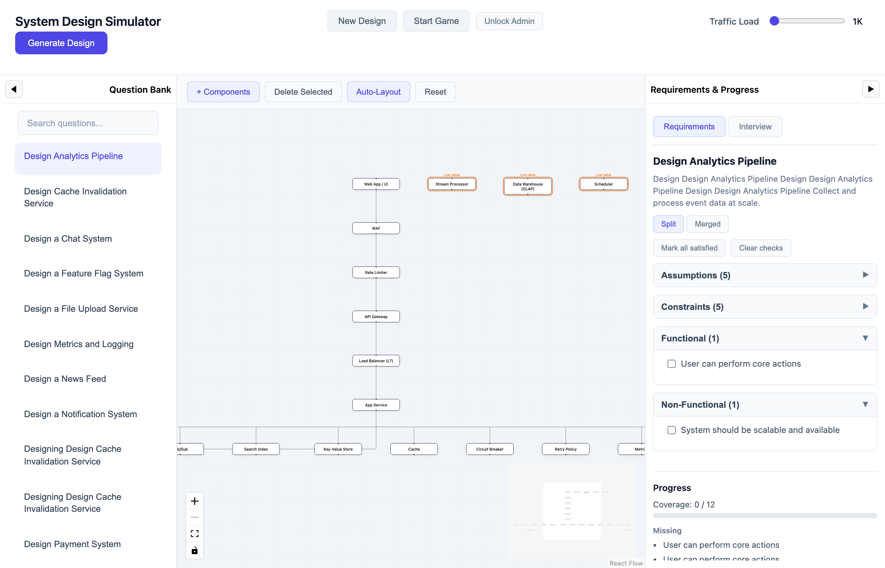
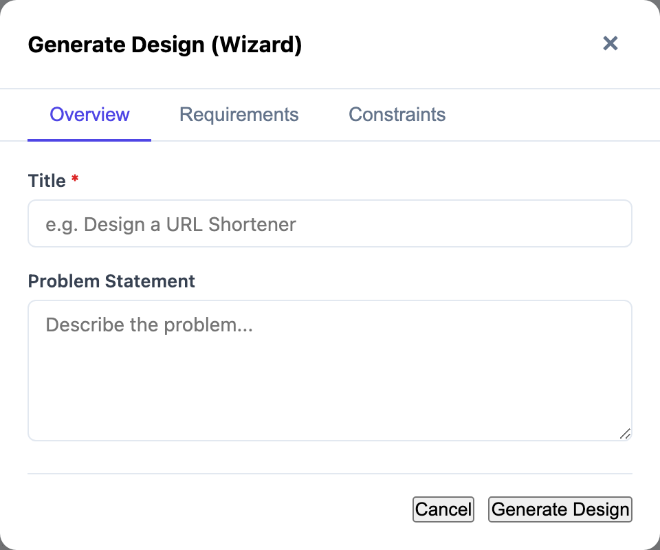

# System Design Simulator

A Cursor-first, offline node-based system design practice tool. Upload PDFs, build diagrams, and practice with two local AI agents (Creator + Interviewer). No external APIs.

## Run the app

### 1. Install dependencies

```bash
npm install
```

### 2. Start the backend server

```bash
npm run server
```

The server runs at [http://localhost:3000](http://localhost:3000).

### 3. Start the frontend (dev)

```bash
npm run dev
```

Open [http://localhost:5173](http://localhost:5173) in your browser.

## UI Overview

### Main view


Three-panel layout: **Question Bank** (left), **flow diagram canvas** (center), **Requirements & Progress** (right). Header has New Design, Start Game, Admin, and Traffic Load slider.

### Question Bank


Left panel listing system design question packs. Search bar filters by title. Click a pack to load its suggested diagram and requirements.

### Diagram canvas


Node-based architecture diagram with layered layout (Edge → App → Async → Data → Observability). Click nodes to view notes; use Add Node, Delete, Auto-Layout, Reset, Undo.

### Design Wizard


Generate a new design from scratch. Enter title, problem statement, functional/non-functional requirements, and constraints. The Creator agent produces a production-grade diagram.

---

*To capture fresh screenshots (run `npm run server` and `npm run dev` first):*
```bash
node scripts/capture-screenshots.js
```

## Data storage (survives server restart)

All data is stored under `server/data/`:

| Path | Purpose |
|------|---------|
| `server/data/packs.json` | Question packs library (id, title, requirements, suggested nodes/edges) |
| `server/data/store.json` | Baselines, drafts, and **interview sessions** (chat history per pack) |
| `server/data/sessions.json` | Legacy interview sessions (phase, history per pack) |
| `server/data/creator/memory.jsonl` | Creator agent memory (offline training chunks) |
| `server/data/interviewer/memory.jsonl` | Interviewer agent memory |
| `server/data/transcripts/` | Transcribed video/audio files from Admin training |
| `server/data/uploads/` | Uploaded video/audio files |
| `server/data/questions.json` | Legacy store (baselines, drafts, questions) |

## Admin training (offline)

1. Click **Admin** in the header.
2. **Upload** a local video or audio file (field: `video`).
3. **Transcribe** – uses Whisper if configured; otherwise returns a mock transcript and shows a warning.
4. **Train selection**: Choose **Creator**, **Interviewer**, or **Both**.
5. **Build memory** – chunks the transcript and appends to the selected agent(s).

To use real transcription, set:

```bash
export WHISPER_BIN=/path/to/whisper-cli
export WHISPER_MODEL=/path/to/ggml-base.bin
```

Without these, a deterministic mock transcript is used and a warning is shown.

## Interview mode (senior interviewer)

The Interviewer agent behaves like a senior system design interviewer:

- **Phases:** requirements → HLD → APIs/data → scaling → consistency → failure → security → wrap-up
- **Component-specific questions:** Add Load Balancer → L7/L4, health checks, sticky sessions. Add Cache → what is cached, keys, TTL, invalidation, consistency. Add Message Queue → ordering, retries, idempotency, DLQ. Add DB → partition key, hot keys, read/write path.
- **Challenges vague answers:** e.g. *"What's your expected QPS and what specifically is the bottleneck?"*
- **Corrects wrong claims:** e.g. *"LB doesn't control client behavior; it routes requests. What routing strategy and health checks?"*
- **Focus line** shows current topic (e.g. *Focus: cache, latency, consistency*).
- **Reset Interview** clears the session. Session persists in `server/data/store.json`.

Run a 6-turn simulation:
```bash
npm run simulate-interview
```

## PDF ingest

- Upload a PDF via the header file input.
- The **Creator agent** summarizes the PDF into a clean **Question Pack**:
  - Functional requirements (5–10 bullets)
  - Non-functional requirements (5–10 bullets)
  - Assumptions, constraints (optional)
  - Suggested nodes/edges
  - Flagged noise/unnecessary content
- The pack is stored in `packs.json` and returned.
- The Requirements panel shows structured bullets only (no raw PDF dump).

## Question Bank

- Lists pack **titles** only.
- Search filters by title.
- Clicking a title loads the pack, updates the Requirements panel, and applies auto-layout to the diagram.
- Left and right panels are collapsible (chevron); collapsed state is stored in `localStorage`.

## Diagram

- **Add Node** / **Delete Selected** / **Auto-Layout** (Dagre) / **Reset** / **Undo** (one-step).
- Reset restores the diagram from the pack’s `suggestedNodes` / `suggestedEdges` (or baseline).
- When you add a node that doesn’t satisfy any requirement, a non-blocking warning appears.

## Tech

- **Vite + React** for the UI.
- **Express** server; ESM modules.
- **No external APIs** – fully offline.

### Local LLM (optional)

Interview and Creator agents work in **stub mode** by default (rule-based heuristics). For richer responses, configure a local LLM:

**Option A – Llama server:**
```bash
export LLAMA_SERVER_URL=http://localhost:8080
```

**Option B – Llama.cpp CLI:**
```bash
export LLAMA_BIN=/path/to/llama-cli
export MODEL_PATH=/path/to/model.gguf
```

Without these, the agents still run locally with deterministic stubs.

## Build

```bash
npm run build
```

## Preview production build

```bash
npm run preview
```
